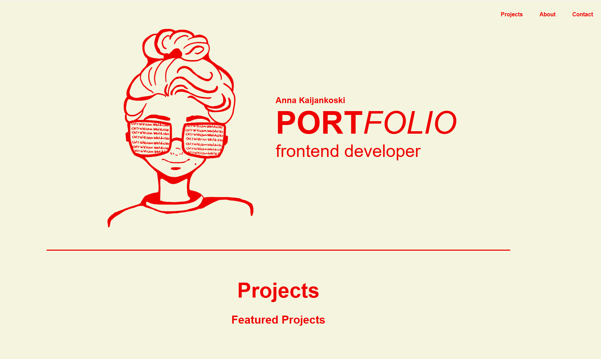

# Portfolio

A multi-page portfolio website showcasing selected projects from my last year of Front-end Development at Noroff.

## Description

The purpose of this project was to expand my original portfolio into a multi-page website that presents and evaluates previous coursework.

The portfolio includes three featured projects:

- Crow Auction House (Semester Project 2)
- Want Some Tea? (CSS Frameworks)
- MyShop (JavaScript Frameworks)

Each project page contains:

- Project description
- Technologies used
- Links to the live site and GitHub repository
- Improvements made after the original submission
- Before and after screenshots

## Built With

- HTML
- css
- JavaScript

## Installing

Clone the repository:

git clone <repository-url>

## Running

Open the project in your preferred code editor and launch index.html using Live Server.

## Improvements

Several improvements were made to previously submitted projects:

Improved navigation and layout in Want Some Tea?
Added loading states and cart improvements in MyShop
Improved filtering logic in Crow Auction House